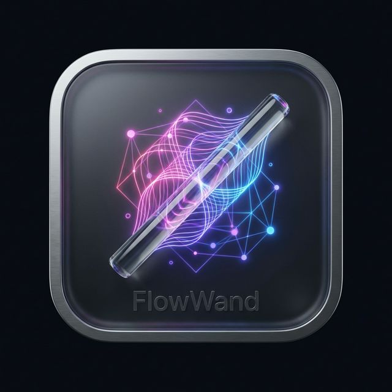

# 🪄 FlowWand — Event Mesh Designer

<p align="center">
  
</p>

<p align="center">
  <strong>A premium, interactive visual designer for event-driven architectures.</strong><br/>
  Design, simulate, and trace data flows across Kafka streams, SQS queues, SNS topics, and custom consumers — all in a beautiful, real-time canvas.
</p>

<p align="center">
  <a href="https://buymeacoffee.com/sumanth_js" target="_blank">
    
  </a>
</p>

---

## ✨ Features

- **🎨 Visual Architecture Canvas** — Drag, connect and arrange Event Streams (Kafka, SQS, SNS) and Consumers on a high-performance React Flow graph
- **🚀 Live Simulation Engine** — Fire events into any stream and watch animated particles flow through the pipeline in real-time
- **🎭 Fun Animations** — Choose from circles, diamonds, stars, or emoji particles (🍕 Pizza, 👻 Ghost, 🚀 Rocket, 👽 Alien, ❤️ Heart)
- **🔍 Click-to-Inspect Nodes** — Click any node for a read-only details view showing stream type, partitions, connected events, source/sink mappings
- **🌈 Color-Coded Flows** — Organize consumers into logical Flows with vivid neon colors. Spotlight any flow to isolate its path on the canvas
- **📋 Event Type Registry** — Define event types with JSON schemas and tag them to specific streams and consumer connections
- **📊 Event Trace Log** — Real-time simulation log with payload inspection for every hop in the pipeline
- **🤖 Schema-Aware Mocking** — Consumer outputs automatically synthesize new generated payloads traversing edge connections based on attached Event Schemas
- **⚡ Adjustable Speed** — Control simulation speed from 0.25× slow-motion to 4× fast-forward
- **💾 Project Management** — Multiple projects, local persistence, JSON export/import
- **✨ One-Click Demo** — Load a fully-wired e-commerce order processing pipeline instantly
- **🌗 Dark & Light Themes** — Premium glassmorphic dark mode and a clean light theme
- **🛡️ Fully TypeScript** — End-to-end type safety across store, hooks, components, and utilities

## 🛠️ Tech Stack

| Layer | Technology |
|-------|-----------|
| **Framework** | [React](https://reactjs.org/) + [TypeScript](https://www.typescriptlang.org/) |
| **Build** | [Vite](https://vitejs.dev/) |
| **Graph Engine** | [@xyflow/react](https://reactflow.dev/) (React Flow) |
| **State** | [Zustand](https://github.com/pmndrs/zustand) |
| **Animations** | [Framer Motion](https://www.framer.com/motion/) |
| **Layout** | [Dagre](https://github.com/dagrejs/dagre) (auto-layout) |
| **Icons** | [Lucide React](https://lucide.dev/) |
| **Styling** | Vanilla CSS with custom design tokens |

## 🚀 Getting Started

```bash
# Clone
git clone https://github.com/Sumanth1908/flow-wand.git
cd flow-wand

# Install
npm install

# Run
npm run dev
```

Open [http://localhost:5173](http://localhost:5173) in your browser.

> **Quick start:** Click the project dropdown → **✨ Load Demo** to instantly see a full e-commerce event mesh.

## 📖 Usage

### Creating an Architecture

1. **Add Event Types** — Define your domain events (e.g., `OrderPlaced`, `PaymentProcessed`) with JSON schemas
2. **Add Streams** — Create Kafka topics, SQS queues, or SNS topics and tag relevant events
3. **Add Consumers** — Wire up processing services with source streams (input) and sink streams (output)
4. **Define Flows** — Group related consumers into color-coded flows for visual organization

### Running Simulations

1. Open **Settings** (⚙️) in the bottom HUD to pick animation style & speed
2. Click **Fire Event** → select a source stream → inject a JSON payload
3. Watch the animated particles traverse your architecture in real-time
4. Open the **Event Trace Log** drawer to inspect payloads at each hop

## 🛠️ Development

```bash
# Type check
npx tsc --noEmit

# Production build
npm run build
# Note: Vite chunking is optimized to automatically split `framer-motion`, `@xyflow`, and `lucide-react` into manual chunks to avoid minification limits.
```

## 📄 License

MIT © [Sumanth Jillepally](https://github.com/Sumanth1908)

---

<p align="center">
  Made with ❤️ by <a href="https://linkedin.com/in/sumanthjillepally">Sumanth</a>
</p>

<p align="center">
  <a href="https://buymeacoffee.com/sumanth_js" target="_blank">
    
  </a>
</p>