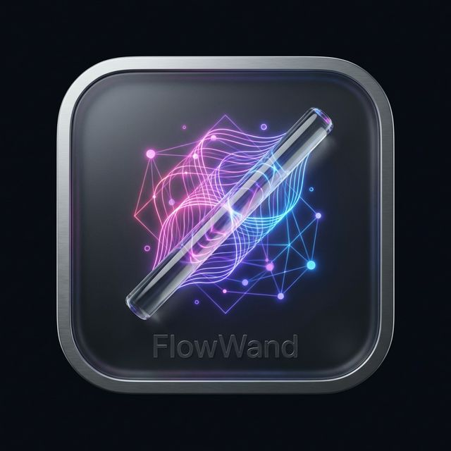

# 🪄 FlowWand — Event Mesh Designer

<p align="center">
  
</p>

<p align="center">
  <strong>A premium, interactive visual designer for event-driven architectures.</strong><br/>
  Design, simulate, and trace data flows across Kafka streams, SQS queues, SNS topics, and custom consumers — all in a beautiful, real-time canvas.
</p>

<p align="center">
  <a href="https://buymeacoffee.com/sumanth_js" target="_blank">
    
  </a>
</p>

---

## ✨ Features

- **🎨 Visual Architecture Canvas** — Drag and arrange Event Streams (Kafka, SQS, SNS) and Consumers on a React Flow graph; configure connections in the consumer editor
- **🚀 Live Simulation Engine** — Fire events into any stream and watch animated particles flow through the pipeline in real-time
- **🎭 Fun Animations** — Choose from circles, diamonds, stars, or emoji particles (🍕 Pizza, 👻 Ghost, 🚀 Rocket, 👽 Alien, ❤️ Heart)
- **🔍 Click-to-Inspect Nodes** — Click any node for a read-only details view showing stream type, partitions, connected events, source/sink mappings
- **🌈 Color-Coded Flows** — Organize consumers into logical Flows with vivid neon colors. Spotlight any flow to isolate its path on the canvas
- **📋 Event Type Registry** — Define event types with JSON Schema plus example payloads and tag them to consumer connections
- **📊 Event Trace Log** — Real-time simulation log with payload inspection for every hop in the pipeline
- **🤖 Schema-Aware Mocking** — Consumer outputs fill missing fields from attached event schemas while preserving transformed data
- **🧭 Event-Aware Routing** — Simulation envelopes retain event identity across stream, consumer, conditional, and DLQ hops
- **⚡ Adjustable Speed** — Control simulation speed from 0.25× slow-motion to 4× fast-forward
- **💾 Project Management** — Multiple projects, automatic local saving, validated JSON export/import, and recovery backups
- **✨ One-Click Demo** — Load a fully-wired e-commerce order processing pipeline instantly
- **🌗 Dark & Light Themes** — Premium glassmorphic dark mode and a clean light theme
- **🛡️ Fully TypeScript** — End-to-end type safety across store, hooks, components, and utilities

## 🛠️ Tech Stack

| Layer | Technology |
|-------|-----------|
| **Framework** | [React](https://reactjs.org/) + [TypeScript](https://www.typescriptlang.org/) |
| **Build** | [Vite](https://vitejs.dev/) |
| **Graph Engine** | [@xyflow/react](https://reactflow.dev/) (React Flow) |
| **State** | [Zustand](https://github.com/pmndrs/zustand) |
| **Animations** | [Framer Motion](https://www.framer.com/motion/) |
| **Layout** | [Dagre](https://github.com/dagrejs/dagre) (auto-layout) |
| **Icons** | [Lucide React](https://lucide.dev/) |
| **Styling** | Vanilla CSS with custom design tokens |

## 🚀 Getting Started

```bash
# Clone
git clone https://github.com/Sumanth1908/flow-wand.git
cd flow-wand

# Install
npm ci

# Run
npm run dev
```

Open [http://localhost:5173](http://localhost:5173) in your browser.

> **Quick start:** Click the project dropdown → **✨ Load Demo** to instantly see a full e-commerce event mesh.

## 📖 Usage

### Creating an Architecture

1. **Add Event Types** — Define your domain events (e.g., `OrderPlaced`, `PaymentProcessed`) with JSON schemas
2. **Add Streams** — Create Kafka topics, SQS queues, or SNS topics and tag relevant events
3. **Add Consumers** — Wire up processing services with source streams (input) and sink streams (output)
4. **Define Flows** — Group related consumers into color-coded flows for visual organization

### Running Simulations

1. Open **Settings** (⚙️) in the bottom HUD to pick animation style & speed
2. Click **Fire Event** → select a source stream → inject a JSON payload
3. Watch the animated particles traverse your architecture in real-time
4. Open the **Event Trace Log** drawer to inspect payloads at each hop

## 🛠️ Development

```bash
# Type check
npx tsc --noEmit

# Production build
npm run build

# Lint + unit/workflow tests + production build
npm run check

# Install the Chromium browser once, then run browser regression tests
npx playwright install chromium
npm run test:e2e

# Run all checks, including browser tests
npm run check:all
```

Consumer conditions and transformations use a restricted payload expression language. Conditions support comparisons and boolean logic such as `payload.amount > 10 && payload.status === "ready"`. Transformations support payload-field assignments and a final return, for example `payload.status = "processed"; return payload;`. Browser globals and function calls are intentionally unavailable.

## Persistence and recovery

Entity edits, node drags, and completed edge bends save automatically. The Save button and Cmd/Ctrl+S save the current project again. JSON export includes the current entity data and layout. If browser storage rejects a write, the app reports the failure, leaves the saved project unchanged, and keeps edit forms open so you can retry.

Imports validate project fields, IDs, references, layout coordinates, and the supported bundle version before writing. Legacy topic/job projects are migrated on read. Invalid saved projects are preserved and show a recovery notice with a **Download recovery backup** action. This backup contains raw FlowWand storage values, including damaged JSON; it is a repair aid, not a project file that can be directly imported. Repair the affected data and import a valid project bundle, or remove the damaged project after keeping a backup.

## Architecture and regression tests

- `src/domain/project.ts` owns pure entity mutations and reference/layout cleanup.
- `src/domain/validation.ts` validates and migrates data at import/load boundaries.
- `src/store/projectActions.ts` constructs domain changes; `useStore.ts` commits one project snapshot before publishing it to the UI.
- `src/lib/storage.ts` handles browser persistence and rolls back partial snapshot writes on failure.
- `src/lib/buildGraph.ts` computes graph topology/layout separately from simulation decoration. Playback and edge bending do not rerun Dagre.
- The consumer editor is split into connection, logic, and routing-rule components. The canvas separates controls from graph synchronization.

Simulation limits count stream/event-type visits within each event's ancestry. Independent branches can converge without being treated as cycles; payload-changing loops remain bounded. A separate execution cap limits the total work. A final playback tick marks the simulation complete while preserving its trace.

Unit/workflow tests cover routing, completion, parsing, storage failure, migrations, validation, deletion cleanup, and layout round trips. Playwright tests run against the production build and cover canvas interaction, import/export, script validation, failed saves, project switching, and recovery. Pull requests run the same checks and Chromium tests; deployment only runs after successful checks on main or a manual workflow run.

## 📄 License

MIT © [Sumanth Jillepally](https://github.com/Sumanth1908)

---

<p align="center">
  Made with ❤️ by <a href="https://linkedin.com/in/sumanthjillepally">Sumanth</a>
</p>

<p align="center">
  <a href="https://buymeacoffee.com/sumanth_js" target="_blank">
    
  </a>
</p>
